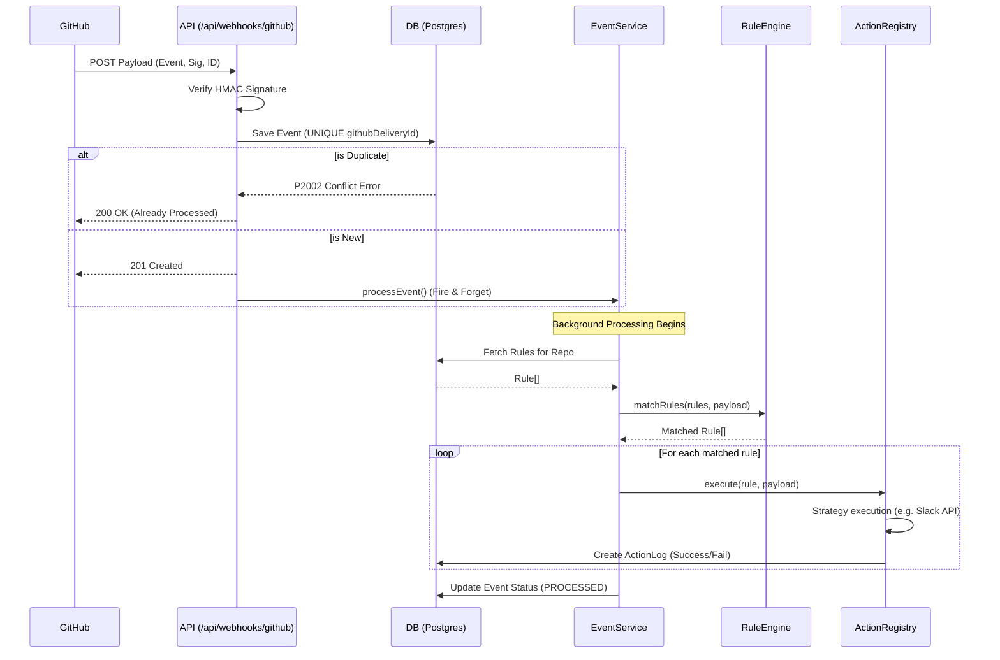
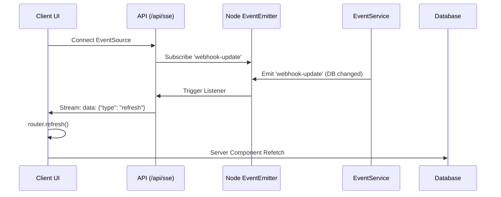

# Architecture & Design

This document details the architecture of the GitHub Automation Bot, including component responsibilities, database design, and key execution flows.

## Core Layers

1. **Routing & I/O (`src/app/api/webhooks/github`)**
   - Handles HTTP requests from GitHub.
   - Reads raw byte streams for HMAC signature validation.
   - Saves payloads to the database idempotently (preventing duplicates).
   - Returns a `201 Created` immediately and fires the orchestrator asynchronously.

2. **Orchestration (`src/services/event.service.ts`)**
   - Drives the lifecycle of a `WebhookEvent`.
   - Queries the database for rules matching the event's repository.
   - Delegates condition evaluation to the Rule Engine.
   - Delegates side effects to the Action Registry.
   - Updates the final `WebhookEvent` status (`PROCESSED`, `IGNORED`, `FAILED`).

3. **Rule Engine (`src/services/rule-engine.service.ts`)**
   - A pure, stateless class.
   - Takes a `Rule[]` and a payload context, returning only the matched `Rule[]`.
   - Supports dot-notation path resolution (e.g., `pull_request.title`).
   - Supports operators: `equals`, `notEquals`, `contains`, `startsWith`, `endsWith`.

4. **Action Strategies (`src/lib/actions/`)**
   - Implements the Strategy Pattern (`IActionStrategy`).
   - Resolves the rule's side effect (e.g., calling GitHub API or Slack).
   - Wrapped by `action.service.ts` to ensure every execution logs a success/failure to the `ActionLog` table.

## Database Schema (Prisma)

- **`User` / `Account` / `Session`**: Managed by Auth.js for GitHub OAuth.
- **`Repository`**: A connected GitHub repo. Stores the `webhookSecret` generated during setup.
- **`Rule`**: A user-defined automation. Contains a JSON array of `conditions`, the target `eventType`, and an `actionType` + `actionPayload`.
- **`WebhookEvent`**: A log of every payload received from GitHub. Driven by the `githubDeliveryId` to prevent duplicate processing. Status tracks `PENDING`, `PROCESSED`, `IGNORED`, or `FAILED`.
- **`ActionLog`**: A historical record of every side effect attempted by the bot, tracking success or the exact error message.

## Sequence Diagrams

### Webhook Delivery & Processing Pipeline

### Live Updates (SSE) Flow

